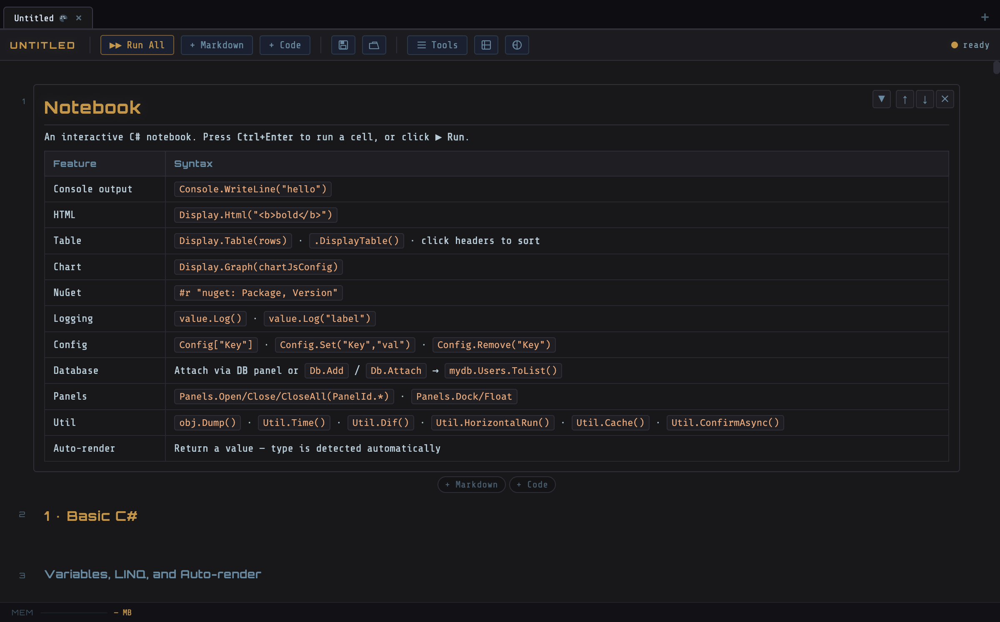
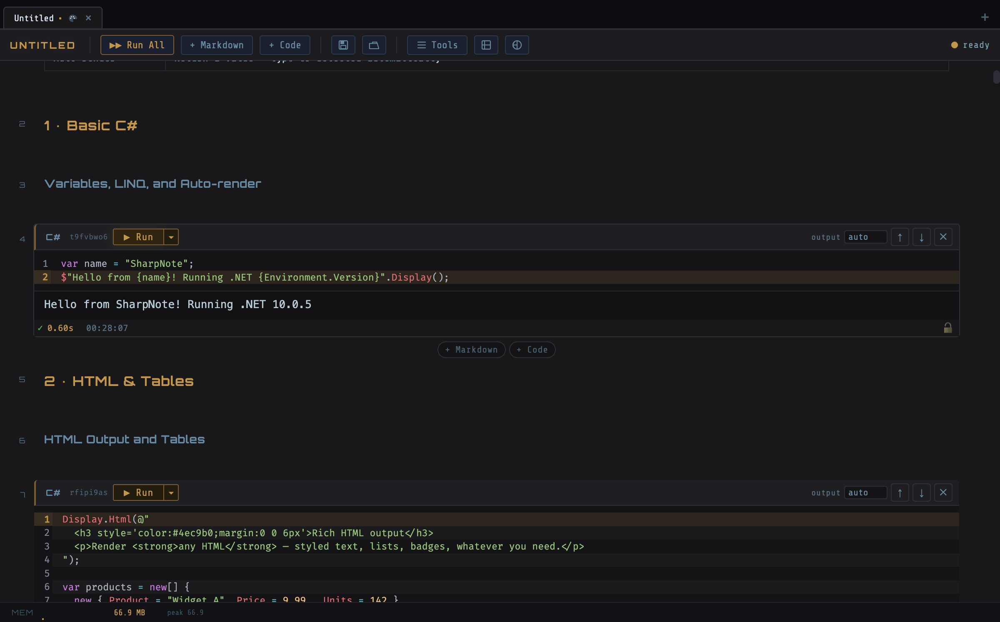
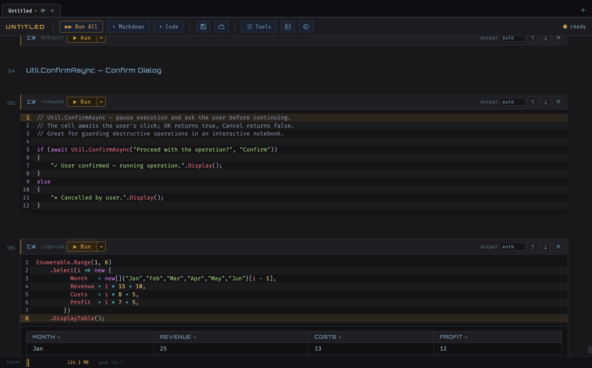
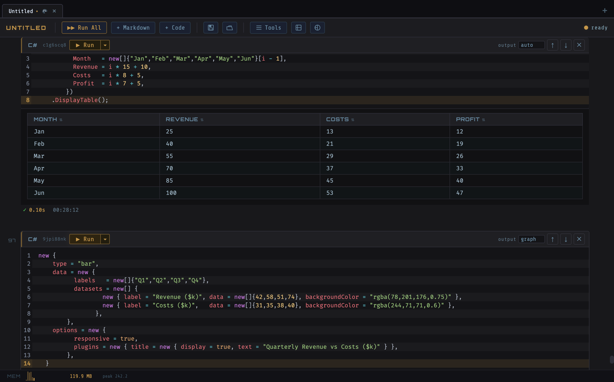
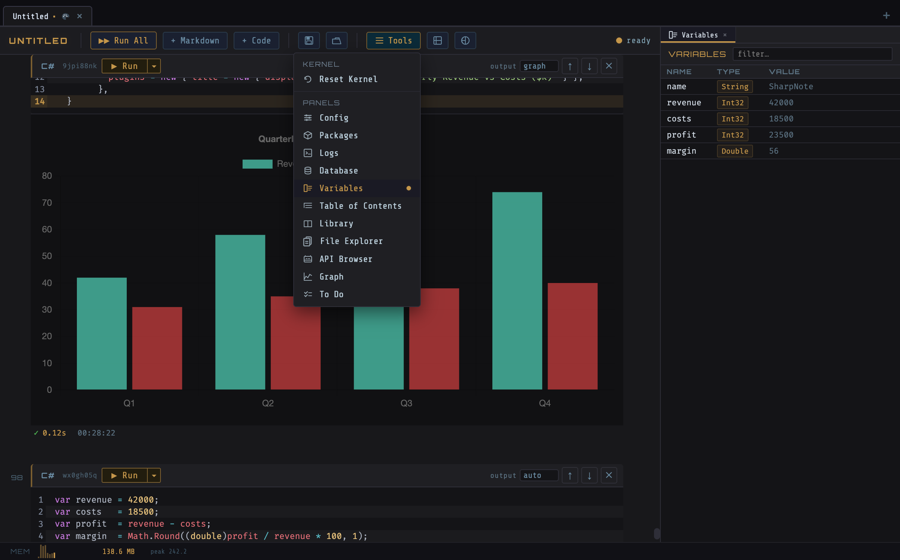
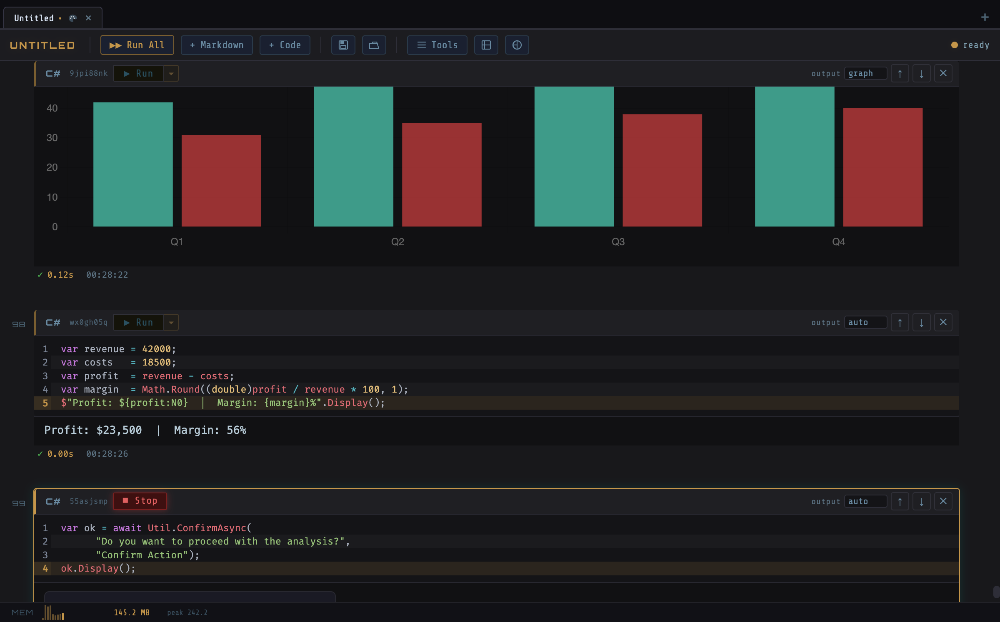
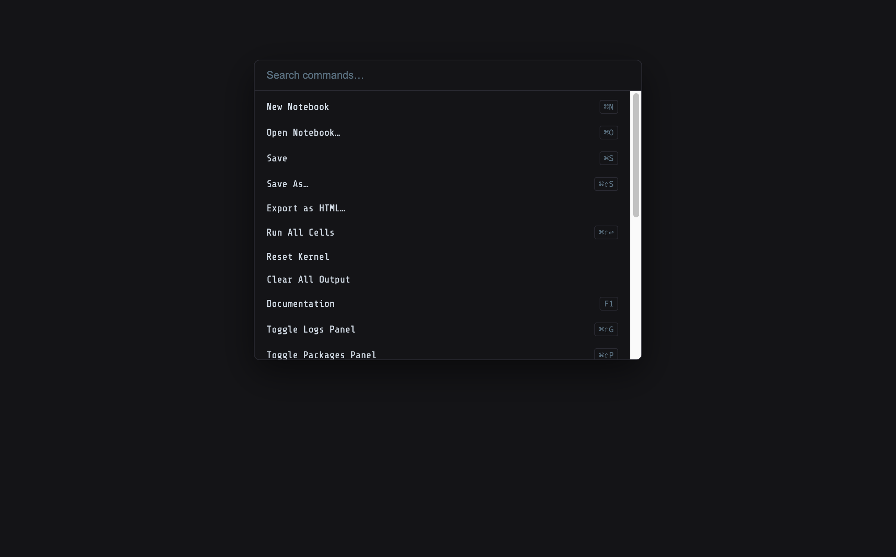
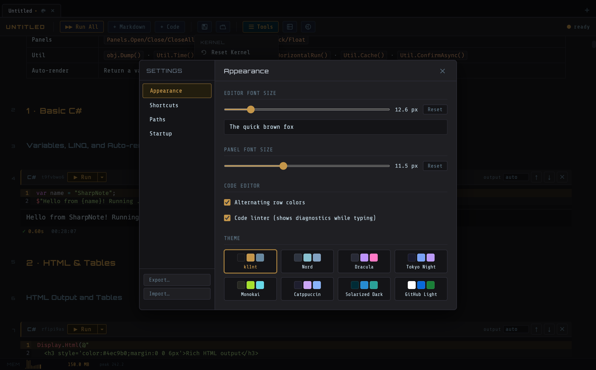
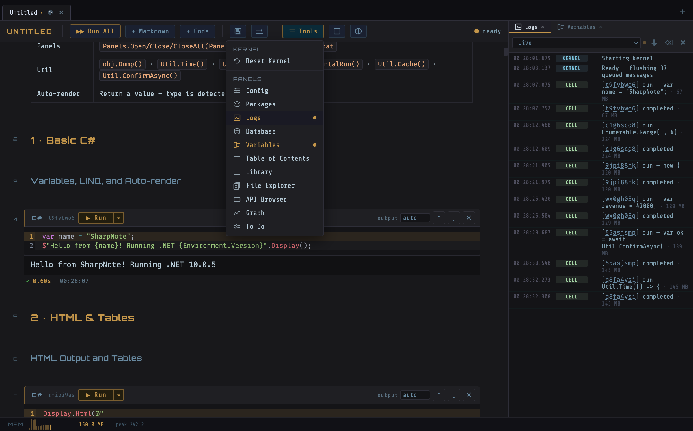
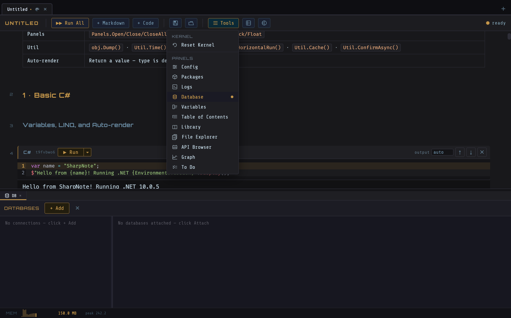

# SharpNote

> Interactive C# notebook application — multi-tab MDI, NuGet package management, database integration, Chart.js visualisations, and a full dock layout system.


---

## Table of Contents

- [SharpNote](#sharpnote)
  - [Table of Contents](#table-of-contents)
  - [Screenshots](#screenshots)
  - [Features](#features)
  - [Architecture](#architecture)
    - [Electron Main Process (`main.js`)](#electron-main-process-mainjs)
    - [React Renderer (`src/`)](#react-renderer-src)
    - [C# Kernel (`kernel/`)](#c-kernel-kernel)
    - [IPC Protocol](#ipc-protocol)
    - [Multi-Kernel Architecture](#multi-kernel-architecture)
    - [Database Integration](#database-integration)
    - [Dock Layout System](#dock-layout-system)
  - [Project Structure](#project-structure)
  - [Prerequisites](#prerequisites)
  - [Getting Started](#getting-started)
  - [Debugging](#debugging)
    - [Opening DevTools](#opening-devtools)
    - [Log files and persisted data](#log-files-and-persisted-data)
    - [Dev vs packaged differences](#dev-vs-packaged-differences)
    - [Common issues](#common-issues)
  - [Building for Distribution](#building-for-distribution)
  - [Maintenance](#maintenance)
  - [Testing](#testing)
    - [JavaScript — Vitest](#javascript--vitest)
    - [E2E — Playwright](#e2e--playwright)
    - [C# — xUnit](#c--xunit)
  - [Extending](#extending)
    - [Adding a panel](#adding-a-panel)
    - [Adding a kernel scripting API](#adding-a-kernel-scripting-api)
    - [Adding a DB provider](#adding-a-db-provider)
  - [Keyboard Shortcuts](#keyboard-shortcuts)
  - [Notebook File Format](#notebook-file-format)

---

## Screenshots

| Overview | Code Execution |
|---|---|
|  |  |

| Table Output | Graph Output |
|---|---|
|  |  |

| Variables Panel | Confirm Widget |
|---|---|
|  |  |

| Command Palette | Settings |
|---|---|
|  |  |

| Dock Layout — Multiple Panels | Database Panel |
|---|---|
|  |  |

---

## Features

### Editor & Execution

- **Multi-tab MDI** — open multiple notebooks simultaneously in a tabbed interface with per-tab colour coding, pin-to-keep, and rename-on-double-click
- **C# REPL** — each cell is evaluated using Roslyn scripting; state is shared across cells within a notebook, with `using`/`#r` directives supported
- **Per-notebook kernel** — every open notebook gets its own isolated .NET process; kernels start on demand and can be reset independently
- **Cell execution control** — Run, Stop (interrupt via cancellation token injection), Run From Here, Run To Here
- **Autocomplete** — Roslyn `ResolveCompletion` backed; falls back to a C# keyword list while the kernel is starting; Tab accepts a completion (Enter remains a normal newline); a toggle in Settings → Appearance enables or disables the live linter
- **Lint** — real-time Roslyn diagnostics; squiggles rendered via the CodeMirror lint extension
- **Reactive Cell Dependencies** — after a successful execution, downstream cells that reference any variable whose value changed are flagged with a "↺ upstream variables changed" banner, clearing automatically when those cells are run
- **Cell Output History** — re-running a cell preserves the previous outputs; a ‹ › navigator in the cell footer lets you browse the last 5 runs to compare results across executions
- **`Util` helper** — LinqPAD-compatible utilities available as a global: `.Dump()` / `.DumpTable()` aliases, `Util.Cmd()` shell command execution, `Util.Time()` benchmarking, `Util.Dif()` LCS line diff, `Util.HorizontalRun()` side-by-side layout, `Util.Metatext()` / `Util.Highlight()` styled output, `Util.Cache<T>()` cross-execution memoization cleared on kernel reset, `Util.ConfirmAsync()` interactive OK/Cancel dialogs that pause execution, `Util.PromptAsync()` text-input dialogs
- **Cell folding** — collapse any code cell to a single-line preview using the ▾/▸ toggle in the cell header; the cell remains executable while folded; fold state is persisted in the `.cnb` file
- **Cell output toggle** — show or hide cell output with the ▾ Output / ▸ Output toggle above each output block; useful for decluttering long-running cells
- **Find in Notebook** — `Ctrl+F` opens a floating search bar that searches across all cell contents; ↑ / ↓ buttons (or Enter / Shift+Enter) navigate between matches; matched cells are highlighted; press Escape to close
- **Auto-run on open** — the ⚡ toolbar button enables auto-run mode per notebook; when enabled, all code cells are run automatically when the notebook opens and the kernel becomes ready; state is saved in the `.cnb` file

### Output & Display

- **Rich output** — `Display.Html()`, `Display.Table()`, `Display.Graph()` (Chart.js), `Display.Csv()`, `Display.Image()` (URL / file path / base64 data URI), and `Console.Write` captured as `stdout`
- **Object tree viewer** — complex objects displayed via `.Display()` / `.Dump()` render as an interactive collapsible tree instead of a flat JSON block; nested objects and arrays can be expanded or collapsed individually
- **Progress bars** — `Display.Progress(label, total)` creates a live-updating progress bar; call `.Report(n)` to update the fill and percentage, `.Complete()` to mark it done; updates stream to the output in real time
- **PDF export** — File → Export as PDF… exports the active notebook's output to a paginated A4 PDF using Electron's `printToPDF()`
- **Display.Markdown** — `Display.Markdown(text)` renders markdown from C# code with Mermaid diagram and KaTeX math support, enabling dynamic reports and documentation generation
- **Graph panel** — live time-series chart driven by `Display.Plot(name, value)` calls; per-variable avg / max overlay lines; Clear button and `Display.ClearGraph()` API; chart type, legend toggle (`Ctrl+Shift+R`)
- **Interactive Widgets** — `Display.Slider()`, `Display.Dropdown()`, and `Display.DatePicker()` render live controls in cell output; widget values persist between cell executions and are sent back to the kernel on change
- **Table column sorting** — click any column header to sort ascending; click again for descending; third click restores original order; numeric columns sort numerically, not lexically
- **Notebook Export** — File → Export as HTML… generates a self-contained dark-themed HTML file containing all cell sources, markdown renders, and outputs; no external dependencies required to view it
- **Memory sparkline** — kernel reports heap usage every 3 s; rendered as an SVG bar chart in the status bar

### Panels

- **Variables panel** — live snapshot of the kernel's global state after each execution
- **Variable Sparklines** — the Variables panel tracks the history of numeric variables and renders a mini trend sparkline for each one, updated after every execution
- **Variable Inspection** — click ⊕ in the Variables panel to open a full-value inspection dialog; Load Full Value fetches the complete JSON-serialised representation from the kernel with a copy-to-clipboard button
- **Log panel** — structured, time-stamped kernel log stream with `NOTEBOOK` lifecycle entries and `USER` entries written by `.Log()` calls in scripts
- **Log panel cell links** — cell IDs that appear in log entries are rendered as clickable links that navigate directly to the corresponding cell; code cells show their ID in muted text in the header
- **Table of Contents** — live heading outline from markdown cells; click any entry to scroll to it
- **To Do panel** — auto-scans code cells for `// TODO`, `// FIXME`, and `// BUG` comments; click any item to scroll to and highlight the originating cell (`Ctrl+Shift+O`)
- **Config panel** — per-notebook key/value store; readable via `Config["key"]` and writable from code via `Config.Set(key, value)` / `Config.Remove(key)` — changes reflect in the panel in real time
- **Panel scripting API** — `Panels.Open/Close/Toggle/CloseAll` controls panel visibility; `Panels.Dock(PanelId.*, DockZone.*, size?)` and `Panels.Float(PanelId.*, x?, y?, width?, height?)` move panels between dock zones or float them with precise position and size; `Db.Add/Remove/Attach/Detach/ListAsync` manages database connections from code
- **Dock layout** — panels can be docked to left / right / bottom zones, floated freely, or dragged between zones; opening a panel via the toolbar auto-switches to its tab and briefly highlights it; tab bars show scroll-shadow indicators when tabs overflow; layouts can be saved and restored by name

### Data & Integration

- **NuGet integration** — add packages via `#r "nuget: PackageName, Version"` directives or through the Packages panel; multiple package sources supported
- **Database integration** — connect to SQLite, SQLite (In-Memory), SQL Server, PostgreSQL, or Redis; for relational providers the schema is introspected and a typed `DbContext` + POCO classes are code-generated and injected; Redis injects a `StackExchange.Redis.IDatabase` variable
- **SQL cells** — add a SQL cell (+ SQL button) to write and execute raw SQL queries directly against any attached database; SELECT results render as a data table; DDL / DML shows a "N rows affected" status; the database is selected from a dropdown showing all attached connections
- **Code Library** — file-based snippet library stored in `~/Documents/SharpNote Notebooks/Library/`; subfolder navigation, syntax-highlighted preview, insert-as-cell with animation
- **API Browser** — enter any OpenAPI 3.x or Swagger 2.0 spec URL (JSON or YAML) to explore endpoints grouped by tag; expandable detail shows parameters, request body, and response schema types; **Try it** form sends live requests with path/query/body inputs; supports Bearer, API Key, and Basic auth applied to every request; save and recall multiple APIs with their auth config; all requests proxied through the main process for http:// local dev servers

### Developer Experience

- **Settings dialog** — ⌘, / Ctrl+, opens a tabbed preferences dialog: Appearance (font size slider with live preview, theme picker), Paths (open Library / user data / log / documents folders in Finder), Startup (manage pinned notebooks that reopen on launch); Export… / Import… buttons back up and restore all settings (theme, font size, dock layout, DB connections, API configs) as a single JSON file
- **Command Palette** — ⌘K / Ctrl+K opens a fuzzy-search overlay of every action in the app; keyboard-navigable with arrow keys and Enter; results filter as you type
- **Keyboard Shortcuts** — Settings → Shortcuts shows all shortcuts grouped by category with a search box; click any reassignable shortcut to capture a custom key combination; custom bindings are persisted and applied to the application menu instantly
- **Recent files** — last 12 opened notebooks persisted to `userData/recent-files.json`; exposed in the File menu
- **Dark theme** — purpose-built urban dark CSS; no UI framework dependency

---

## Architecture

```
┌─────────────────────────────────────────────────────────┐
│                    Electron Main Process                  │
│  main.js — BrowserWindow, IPC handlers, kernel manager   │
└────────────────────┬────────────────────────────────────┘
                     │  contextBridge (preload.js)
                     │  window.electronAPI.*
┌────────────────────▼────────────────────────────────────┐
│               React Renderer  (src/)                      │
│  src/app/, src/components/, src/hooks/, src/config/      │
│  CodeMirror 6 editors · Chart.js output                  │
└────────────────────┬────────────────────────────────────┘
                     │  JSON lines over child_process stdin/stdout
          ┌──────────▼──────────┐   ┌─────────────────────┐
          │  kernel (notebook A) │   │  kernel (notebook B) │
          │  .NET 10 / Roslyn     │   │  .NET 10 / Roslyn     │
          └─────────────────────┘   └─────────────────────┘
```

### Electron Main Process (`main.js`)

The main process is a single Node.js/CJS file responsible for:

| Concern | Detail |
|---|---|
| Window management | Single `BrowserWindow`; `mainWindow.webContents` sends events to the renderer |
| Multi-kernel map | `kernels: Map<notebookId, { process, ready, pending[] }>` — each notebook gets its own kernel subprocess |
| IPC handlers | ~38 `ipcMain.handle` / `ipcMain.on` registrations covering file ops, kernel lifecycle, DB connections, library, config, and more (see [`preload.js`](#renderer--main-windowelectronapi) for the full surface) |
| File operations | `fs-readdir`, `fs-rename`, `fs-delete` (via `shell.trashItem`), `fs-mkdir`, `fs-get-home` |
| Recent files | Persisted to `<userData>/recent-files.json`; max 12 entries, duplicates moved to front |
| Library | `resolveLibraryPath()` — path-traversal-safe resolver rooted at `~/Documents/SharpNote Notebooks/Library/` |
| DB connections | `<userData>/db-connections.json` — global list of named connection strings |
| Menus | Native macOS / Windows menu built with `Menu.buildFromTemplate`; Tools sub-menu exposes keyboard shortcuts for all panels |
| Logging | Dev mode: `logs/` next to `main.js`; packaged: `<userData>/logs/` |

### React Renderer (`src/`)

The UI is organized across `src/app/`, `src/components/`, `src/hooks/`, and `src/config/`, bundled by esbuild. Key components:

| Component | Responsibility |
|---|---|
| `App` | Root state owner — notebooks array, dock layout, DB connections, saved layouts, drag state |
| `NotebookView` | Toolbar + scrollable cells list for one notebook |
| `CodeCell` | CodeMirror 6 editor + run/stop/chevron controls; lint integration |
| `OutputBlock` | Renders every kernel output type: stdout, error, html, markdown, table (DataTable), csv, graph (Chart.js), image, interrupted |
| `TabBar` / `Tab` | Multi-notebook tabs; color picker rendered via `createPortal` to avoid z-index clipping |
| `FilesPanel` | File explorer with breadcrumb navigation, inline rename, drag-free delete |
| `LibraryPanel` | Code snippet library with subfolder nav and CodeMirror preview |
| `NugetPanel` | Package list + add form + custom source management |
| `ConfigPanel` | Key/value editor for per-notebook config passed to the kernel |
| `VarsPanel` | Live variable snapshot from the kernel (name, type, value) with numeric sparkline history |
| `TocPanel` | Table of Contents — heading outline extracted from markdown cells |
| `DbPanel` | Connection form, schema tree, attach/detach DB |
| `DockZone` | Resizable panel zone (left / right / bottom / float) |
| `FloatPanel` | Free-floating draggable/resizable panel window |
| `LayoutManager` | Named layout save/restore popup |
| `StatusBar` | Cursor position + memory sparkline (`MemorySparkline`) |
| `QuitDialog` | Multi-notebook dirty-file confirmation on window close |

**State model per notebook:**
```js
{
  id, title, path, isDirty, color,
  cells, outputs,
  running: Set<cellId>,
  kernelStatus,           // 'starting' | 'ready' | 'error' | 'stopped'
  nugetPackages,          // [{ id, version, status }]
  nugetSources,           // [{ name, url, enabled }]
  config,                 // [{ key, value }]
  logPanelOpen, nugetPanelOpen, configPanelOpen, dbPanelOpen, varsPanelOpen, tocPanelOpen,
  attachedDbs,            // [{ connectionId, status, varName, schema, error }]
  memoryHistory,          // last 60 memory_mb readings
}
```

### Renderer → Main (`window.electronAPI`)

`preload.js` exposes a `contextBridge`-bridged API under `window.electronAPI`. This is the **only** legal way for renderer code to reach the main process — direct `require('electron')` in renderer code is blocked by `nodeIntegration: false`.

| Group | Methods |
|---|---|
| Kernel lifecycle | `startKernel(id)`, `stopKernel(id)`, `resetKernel(id)`, `interruptKernel(id)` |
| Kernel messaging | `sendToKernel(id, msg)`, `onKernelMessage(cb)`, `offKernelMessage(cb)` |
| Notebooks | `showNewNotebookDialog()`, `saveNotebook(data)`, `saveNotebookTo(path, data)`, `loadNotebook()`, `saveFile(opts)`, `openRecentFile(path)`, `renameFile(old, new)` |
| File explorer | `fsReaddir(path)`, `fsRename(old, new)`, `fsDelete(path)`, `fsMkdir(path)`, `fsOpenPath(path)`, `fsGetHome()` |
| Code library | `getLibraryFiles(subfolder)`, `readLibraryFile(path)`, `saveLibraryFile(path, content)`, `deleteLibraryFile(path)`, `openLibraryFolder()` |
| Logs | `getLogFiles()`, `readLogFile(name)`, `deleteLogFile(name)`, `rendererLog(tag, msg)`, `onLogEntry(cb)`, `offLogEntry(cb)` |
| Settings | `loadAppSettings()`, `saveAppSettings(s)`, `exportSettings(data)`, `importSettings()`, `setFontSize(n)`, `setPanelFontSize(n)`, `rebuildMenu(shortcuts)` |
| DB connections | `loadDbConnections()`, `saveDbConnections(list)` |
| API Browser | `loadApiSaved()`, `saveApiSaved(list)`, `apiRequest(opts)`, `fetchUrl(url)` |
| Recent files | `getRecentFiles()`, `clearRecentFiles()` |
| Menu / UI events | `onMenuAction(cb)`, `updateWindowTabs(tabs)`, `onFontSizeChange(cb)`, `onPanelFontSizeChange(cb)` |
| Quit guard | `onBeforeQuit(cb)`, `confirmQuit()` |
| App info | `getAppVersion()`, `getAppPaths()` |

### C# Kernel (`kernel/`)

The kernel is a self-contained .NET 10 console application that communicates with the main process via **JSON lines over stdin/stdout**.

| File | Responsibility |
|---|---|
| `Program.cs` | Protocol loop, Roslyn script execution, autocomplete, lint, NuGet directive parsing, cancellation token injection, variable snapshot, display system |
| `DbProvider.cs` | `IDbProvider` interface + SQLite / SQL Server / PostgreSQL implementations; schema introspection via `IntrospectAsync` |
| `DbCodeGen.cs` | POCO class + `DbContext` code generation from a `DbSchema`; Roslyn in-memory compilation and injection |

**Exposed scripting APIs:**

```csharp
// ── Text & markup ─────────────────────────────────────────────────────────────
Display.Html("<b>bold</b>");                        // render arbitrary HTML
Display.Markdown("## Title\n\n$E=mc^2$");           // markdown + KaTeX + Mermaid

// ── Data tables ───────────────────────────────────────────────────────────────
Display.Table(myList);                              // render object collection as table
Display.Csv("a,b\n1,2");                            // parse and render CSV string
myList.DisplayTable();                              // extension method shorthand

// ── Charts ────────────────────────────────────────────────────────────────────
Display.Graph(new { type = "bar", data = ... });    // Chart.js config object

// ── Live graph streaming (Graph panel) ───────────────────────────────────────
Display.Plot("series", value);                      // push a value mid-execution
Display.Plot("series", value, PlotMode.RateOfChange); // push delta since last call
Display.ClearGraph();                               // wipe all series in the Graph panel

// ── Interactive widgets ───────────────────────────────────────────────────────
Display.Slider("Label", min, max, step, defaultValue);  // numeric slider
Display.Dropdown("Label", new[] { "A", "B" }, "A");     // option selector
Display.DatePicker("Label", defaultValue: "2025-01-01"); // date input

// ── Logging ──────────────────────────────────────────────────────────────────
"starting pipeline".Log();    // extension method; appears in Log panel, returns value
value.Log("label");           // optional label shown alongside the value

// ── Per-notebook config ───────────────────────────────────────────────────────
Config["key"]                 // read a per-notebook key/value entry
Config.Set("ApiKey", "abc"); // upsert an entry; Config panel updates in real time
Config.Remove("ApiKey");     // delete an entry

// ── Panel control ─────────────────────────────────────────────────────────────
Panels.Open(PanelId.Graph);   // open the Graph panel
Panels.Close(PanelId.Log);    // close the Log panel
Panels.Toggle(PanelId.Db);    // toggle the DB panel
Panels.CloseAll();            // close every open panel
Panels.Dock(PanelId.Graph, DockZone.Right, 0.35); // dock at 35% of window width
Panels.Dock(PanelId.Log, DockZone.Bottom, 200);   // dock at 200 px tall
Panels.Float(PanelId.Variables, x: 800, y: 120, width: 400, height: 500); // float with position+size
// PanelId constants:  Log, Packages, Config, Db, Library, Variables, Toc, Files, Api, Graph, Todo
// DockZone constants: Left, Right, Bottom

// ── Database management ───────────────────────────────────────────────────────
Db.Add("mydb", DbProvider.Sqlite, "Data Source=/data/mydb.db"); // add to global list
Db.Attach("mydb");                        // attach to this notebook; injects typed DbContext
var conns = await Db.ListAsync();         // DbEntry[] { Name, Provider, IsAttached }
Db.Detach("mydb");                        // detach from this notebook
Db.Remove("mydb");                        // remove from global connection list
// DbProvider constants: Sqlite, SqliteMemory, SqlServer, PostgreSql, Redis

// ── Util — LinqPAD-compatible utilities ──────────────────────────────────────
obj.Dump();                                       // alias for obj.Display()
list.DumpTable();                                 // alias for list.DisplayTable()
Util.Cmd("git", "log --oneline -10");             // run shell command, display output
Util.Time(() => DoWork(), "label");               // benchmark Action, display elapsed time
var result = Util.Time(() => Compute(), "fn");    // benchmark Func<T>, display timing + return
Util.Dif(before, after, "before", "after");       // line-by-line diff of two values
Util.HorizontalRun("12px", tableA, tableB);       // render multiple items side by side
Util.Metatext("Generated at 2025-01-01");         // dimmed gray metadata text
Util.Highlight(importantValue, "#ffe066");        // colored highlight box (default: amber)
var data = Util.Cache("key", () => LoadData());  // memoize across executions until reset
Util.ClearCache();                                // clear all cached values
if (await Util.ConfirmAsync("Delete all?", "Confirm"))  // interactive OK/Cancel dialog
    DeleteAll();
```

**Cancellation:** `while`, `for`, `foreach`, and `do-while` loops are automatically rewritten by a Roslyn `CSharpSyntaxRewriter` to call `token.ThrowIfCancellationRequested()` at each iteration. This enables the Stop button to interrupt long-running cells without killing the kernel.

### IPC Protocol

Messages are newline-delimited JSON objects. The renderer sends to the kernel; the kernel sends back.

**Renderer → Kernel:**

| `type` | Payload |
|---|---|
| `execute` | `{ id, code }` |
| `interrupt` | `{}` |
| `reset` | `{}` |
| `lint` | `{ requestId, code }` |
| `autocomplete` | `{ requestId, code, position }` |
| `db_connect` | `{ connectionId, provider, connectionString }` |
| `db_disconnect` | `{ connectionId }` |
| `db_list_response` | `{ requestId, connections: [{name, provider, isAttached}] }` |
| `widget_change` | `{ widgetKey, value }` |
| `exit` | `{}` |

**Kernel → Renderer:**

| `type` | Payload |
|---|---|
| `ready` | — |
| `stdout` | `{ id, content }` |
| `display` | `{ id, format, content, title? }` |
| `error` | `{ id, message, stackTrace }` |
| `complete` | `{ id, success, cancelled }` |
| `lint_result` | `{ diagnostics[] }` |
| `autocomplete_result` | `{ items[] }` |
| `vars_update` | `{ vars[] }` |
| `var_point` | `{ name, value }` — from `Display.Plot`; consumed by the Graph panel |
| `graph_clear` | — — from `Display.ClearGraph`; clears all Graph panel series |
| `panel_open` | `{ panel }` — from `Panels.Open`; opens the named panel |
| `panel_close` | `{ panel }` — from `Panels.Close`; closes the named panel |
| `panel_toggle` | `{ panel }` — from `Panels.Toggle`; toggles the named panel |
| `panel_close_all` | — — from `Panels.CloseAll`; closes all open panels |
| `panel_dock` | `{ panel, zone, size? }` — from `Panels.Dock`; moves panel to zone; `size < 1` = fraction, `size ≥ 1` = pixels |
| `panel_float` | `{ panel, x?, y?, w?, h? }` — from `Panels.Float`; floats panel with optional position/size |
| `db_add` | `{ name, provider, connectionString }` — from `Db.Add` |
| `db_remove` | `{ name }` — from `Db.Remove` |
| `db_attach` | `{ name }` — from `Db.Attach`; triggers `db_connect` to the kernel |
| `db_detach` | `{ name }` — from `Db.Detach`; triggers `db_disconnect` to the kernel |
| `db_list_request` | `{ requestId }` — from `Db.ListAsync`; renderer replies with `db_list_response` |
| `config_set` | `{ key, value }` — from `Config.Set`; upserts Config panel entry |
| `config_remove` | `{ key }` — from `Config.Remove`; deletes Config panel entry |
| `db_schema` | `{ connectionId, schema }` |
| `db_ready` | `{ connectionId, varName }` |
| `db_error` | `{ connectionId, message }` |
| `db_disconnected` | `{ connectionId }` |
| `nuget_preload_complete` | — |
| `memory_mb` | `{ mb }` |
| `log` | `{ tag, message, timestamp }` |
| `reset_complete` | — |

### Multi-Kernel Architecture

Each notebook has its own entry in `kernels: Map<notebookId, KernelEntry>`:

```
KernelEntry = {
  process: ChildProcess,   // spawned dotnet kernel process
  ready: boolean,          // true once 'ready' message received
  pending: Message[],      // queued messages waiting for ready
}
```

- Messages sent before `ready` are buffered in `pending[]` and flushed immediately on `ready`.
- `start-kernel` IPC handler: spawns the process, wires up readline on stdout, handles kernel messages and fan-outs to all open windows.
- `stop-kernel`: sends `{ type: 'exit' }` to the kernel; process is killed after a short grace period.
- `kernel-reset`: kills current process, clears pending queue, spawns fresh.
- `kernel-interrupt`: writes `{ type: 'interrupt' }` to stdin.

### Database Integration

The flow from connection to code-generation:

```
1. User adds a connection (name, provider, connection string) → saved to db-connections.json
2. User attaches a connection to a notebook → IPC db_connect → kernel
3. Kernel calls IDbProvider.IntrospectAsync() → DbSchema (tables, columns, types, PKs)
4. DbCodeGen.GenerateSource() → C# source with POCOs + DbContext + OnConfiguring()
5. Kernel compiles the generated source in-memory (Roslyn) and injects the context
6. Kernel emits db_schema (schema tree for UI) then db_ready
7. User accesses the typed DbContext as a named variable (e.g. `northwind.Orders.ToList()`)
```

Supported providers:

| Provider | Key | Connection string |
|---|---|---|
| SQLite | `sqlite` | `Data Source=/path/to/db.sqlite` |
| SQLite (In-Memory) | `sqlite_memory` | shared-cache name, or blank to auto-generate |
| SQL Server | `sqlserver` | `Server=...;Database=...;` |
| PostgreSQL | `postgresql` | `Host=...;Database=...;` |
| Redis | `redis` | `localhost:6379` or `host:port,password=secret` |

### Dock Layout System

Panels (Library, Log, NuGet, Config, DB) can be placed in four zones:

| Zone | Direction | Default contents |
|---|---|---|
| `left` | Vertical | Library |
| `right` | Vertical | Log |
| `bottom` | Horizontal | NuGet, Config, DB |
| `float` | Free | — |

Layout state is stored as `dockLayout = { assignments, order, sizes, floatPos, zoneTab }` and persisted as part of `saveAppSettings`. Users can save named layouts via the Layout Manager (toolbar icon) and switch between them; loading a layout increments `layoutKey` which forces a full DockZone remount to reset sizes.

When a panel is opened via the toolbar (or a keyboard shortcut), the dock zone automatically switches to show that panel's tab and briefly highlights the panel with an accent outline. Zone tab bars display scroll-shadow indicators on overflowing edges; the active tab scrolls into view automatically.

---

## Project Structure

```
sharpnote/
├── main.js               # Electron main process
├── preload.js            # contextBridge: exposes window.electronAPI to renderer
├── index.html            # App shell (loads dist/renderer.js)
├── package.json
├── vitest.config.js      # JS test configuration
│
├── src/
│   ├── renderer.jsx      # Bundle entry + re-exports
│   ├── styles.css        # Urban dark theme (~2 650 lines)
│   ├── app/              # Root components (App.jsx, StatusBar.jsx)
│   ├── components/       # UI components (editor/, output/, panels/, dock/, toolbar/, dialogs/)
│   ├── hooks/            # Custom React hooks (useResize.js, …)
│   └── config/           # Constants (docs-sections.js, themes, dock-layout defaults, …)
│
├── kernel/
│   ├── kernel.csproj     # .NET 10 project
│   ├── Program.cs        # Protocol loop, Roslyn execution, display system
│   ├── DbProvider.cs     # IDbProvider + SQLite/SQL Server/PostgreSQL
│   ├── DbCodeGen.cs      # Schema → C# POCO + DbContext codegen
│   └── AssemblyInfo.cs   # InternalsVisibleTo kernel.Tests
│
├── kernel/kernel.Tests/
│   ├── kernel.Tests.csproj
│   ├── DbCodeGenTests.cs
│   ├── DbProviderTests.cs
│   ├── CancellationInjectorTests.cs
│   ├── NugetDirectiveTests.cs
│   ├── LintTests.cs
│   └── KernelProtocolTests.cs  # subprocess integration tests
│
├── tests/
│   ├── setup.js                # electronAPI stubs, CodeMirror/Chart.js mocks
│   ├── renderer/               # React component + utility tests (happy-dom)
│   │   ├── utils.test.js
│   │   ├── OutputBlock.test.jsx
│   │   ├── CodeCell.test.jsx
│   │   ├── TabBar.test.jsx
│   │   ├── QuitDialog.test.jsx
│   │   ├── FilesPanel.test.jsx
│   │   ├── DataTable.test.jsx
│   │   ├── VarsPanel.test.jsx
│   │   ├── NugetPanel.test.jsx
│   │   ├── ConfigPanel.test.jsx
│   │   ├── GraphPanel.test.jsx
│   │   ├── TodoPanel.test.jsx
│   │   ├── CommandPalette.test.jsx
│   │   └── SettingsDialog.test.jsx
│   └── main/                   # Main process tests (Node environment)
│       ├── resolveLibraryPath.test.js
│       ├── recentFiles.test.js
│       ├── fileOps.test.js
│       └── kernelLifecycle.test.js
│
├── __mocks__/
│   └── electron.js             # CJS electron mock (used by main.js when VITEST=1)
│
├── assets/
│   ├── icon.icns               # macOS app icon
│   └── icon.png                # Windows/Linux app icon
│
├── scripts/
│   └── patch-electron-icon.js  # postinstall: patches Electron dev icon
│
└── dist/                       # esbuild output (gitignored)
    └── renderer.js
```

---

## Prerequisites

| Tool | Version | Purpose |
|---|---|---|
| Node.js | ≥ 18 | Electron host + build tooling |
| npm | ≥ 9 | Package management |
| .NET SDK | 10 | Kernel build + test |
| Electron | 34 (installed via npm) | Desktop shell |

---

## Getting Started

**1. Clone and install dependencies**

```bash
git clone <repo-url>
cd sharpnote
npm install
```

**2. Run in development mode**

```bash
npm start
```

This bundles the renderer with esbuild, then launches Electron. The kernel subprocess is started automatically when the first notebook is opened.

**3. Your first cell**

```csharp
// In your first code cell:
var nums = Enumerable.Range(1, 5).ToList();
Display.Table(nums.Select(n => new { Number = n, Square = n * n }));
```

---

## Debugging

### Opening DevTools

Press `Ctrl+Shift+I` (Windows / Linux) or `Cmd+Option+I` (macOS) while the app window is focused to open the Chromium DevTools for the renderer process.

The main process (Node.js) writes to the terminal that launched `npm start`. Kernel errors — failed parses, unexpected exits — are printed there too via `console.error`.

### Log files and persisted data

**Log files** are written once per session.

| Platform | Path (packaged) | Path (dev) |
|---|---|---|
| macOS | `~/Library/Application Support/SharpNote/logs/` | `logs/` next to `main.js` |
| Windows | `%APPDATA%\SharpNote\logs\` | `logs/` next to `main.js` |
| Linux | `~/.config/SharpNote/logs/` | `logs/` next to `main.js` |

**Persisted data** (all under Electron's `userData` = the packaged paths above, minus `logs/`):

| File | Contents |
|---|---|
| `recent-files.json` | Last 12 opened notebook paths |
| `db-connections.json` | Named database connection strings |
| `app-settings.json` | Theme, font size, dock layout, custom keyboard shortcuts |
| `api-saved.json` | Saved API Browser configurations |

The **code library** lives separately at `~/Documents/SharpNote Notebooks/Library/`.

### Dev vs packaged differences

| Behaviour | `npm start` (dev) | Packaged app |
|---|---|---|
| Kernel binary | Launched via `dotnet run` from `kernel/` | Pre-compiled self-contained binary from `kernel/bin/<rid>/` |
| Log directory | `logs/` next to `main.js` | `<userData>/logs/` |
| DevTools | Open manually with `Ctrl+Shift+I` | Same |
| Renderer bundle | Must run `npm run build:renderer` first (done automatically by `npm start`) | Bundled at package time |

### Common issues

| Symptom | Likely cause | Fix |
|---|---|---|
| Kernel status stuck on "starting" | .NET 10 SDK not found, or `dotnet` not on PATH | Install [.NET 10 SDK](https://dotnet.microsoft.com/download) and verify with `dotnet --version` |
| White screen on launch | Renderer bundle missing or stale | Run `npm run build:renderer`, or restart via `npm start` which rebuilds automatically |
| NuGet restore hangs or fails | Corporate proxy / firewall blocking nuget.org | Add a local or mirror source in the Packages panel → Sources tab |
| Kernel exits immediately | Missing NuGet packages that were saved in the notebook | Open the Packages panel and click Restore, or remove the offending `#r` directive |
| `app-settings.json` is corrupt | Manual edit or unexpected crash during write | Delete the file — the app recreates it with defaults on next launch |

---

## Building for Distribution

### Standalone installers (no .NET or Node.js required)

These commands do a full clean rebuild and produce a self-contained installer. Electron bundles Node.js and the kernel is compiled with `--self-contained true`, so end users need no runtime dependencies.

```bash
npm run publish:mac   # clean → rebuild → DMG (osx-x64 + osx-arm64)
npm run publish:win   # clean → rebuild → NSIS installer (win-x64)
npm run publish:all   # clean → rebuild → all platforms
```

Output is written to `/tmp/sharpnote-build/`.

### Incremental builds (assumes dependencies already installed)

If you've already run `npm install` and only want to rebuild and package without a full clean:

```bash
npm run dist:mac   # build:renderer + build:kernel:mac + electron-builder --mac
npm run dist:win   # build:renderer + build:kernel:win + electron-builder --win
npm run dist:all   # build:renderer + build:kernel:all + electron-builder --mac --win
```

**Kernel only** (without packaging):
```bash
npm run build:kernel:mac   # osx-x64 + osx-arm64
npm run build:kernel:win   # win-x64
```

Self-contained binaries are placed under `kernel/bin/<rid>/`.

---

## Maintenance

**Remove all build artifacts and dependencies:**
```bash
npm run clean
```

Deletes `release/`, `kernel/bin/`, `kernel/obj/`, `kernel/kernel.Tests/bin/`, `kernel/kernel.Tests/obj/`, `node_modules/`, `dist/`, and `logs/`.

**Full clean rebuild:**
```bash
npm run rebuild:mac   # clean → install → renderer → kernel (osx-x64 + osx-arm64)
npm run rebuild:win   # clean → install → renderer → kernel (win-x64)
npm run rebuild:all   # clean → install → renderer → kernel (all platforms)
```

---

## Testing

### JavaScript — Vitest

```bash
npm test                 # run all tests once
npm run test:watch       # watch mode
npm run test:coverage    # with V8 coverage report
```

**573 JavaScript tests across 33 files.**

The renderer suite (`tests/renderer/`) uses happy-dom and covers React components including CodeCell, OutputBlock, TabBar, VarsPanel, ConfigPanel, NugetPanel, DataTable, FilesPanel, QuitDialog, GraphPanel, TodoPanel, CommandPalette, and SettingsDialog, as well as utility functions. The main-process suite (`tests/main/`) uses the Node environment and covers kernel lifecycle, file operations, recent-files persistence, and library path resolution.

**Notable test infrastructure decisions:**

- `vi.mock('electron', factory)` does not intercept CJS `require('electron')` from within a dynamically-imported CJS module. `main.js` therefore uses `require(process.env.VITEST ? './__mocks__/electron.js' : 'electron')` directly.
- The same limitation applies to `vi.mock('fs')`. `fileOps.test.js` avoids it by using a real temporary directory.
- Renderer tests use **happy-dom** instead of jsdom (jsdom v29 has ESM-compatibility issues with `html-encoding-sniffer`).

### E2E — Playwright

End-to-end tests drive the real Electron app via Playwright's `_electron` API.

```bash
npm run test:e2e           # headless (builds renderer first)
npm run test:e2e:headed    # same but with the Electron window visible
```

**Prerequisites:**

```bash
npx playwright install     # download Chromium/Electron browser binaries (first time only)
```

Tests that exercise kernel execution (cell output, variables panel) additionally require a built kernel binary:

```bash
npm run build:kernel:mac   # macOS
npm run build:kernel:win   # Windows
```

Those tests skip automatically with a helpful message when no binary is found — all UI tests run without a kernel.

**Test files** (`tests/e2e/`):

| File | Scope | Kernel required |
|---|---|---|
| `app.startup.test.js` | Window title, kernel status badge, initial notebook | No |
| `toolbar.test.js` | Toolbar items, Run All, +Code/+Markdown, Save/Open, Tools menu | No |
| `tabs.test.js` | Tab bar, new tab, switching, dirty indicator, rename, color, close | No |
| `cells.lifecycle.test.js` | Add/move/lock/delete cells, output mode selector | No |
| `cells.markdown.test.js` | Markdown edit/commit/cancel/render cycle | No |
| `panels.test.js` | Variables, Config, Logs, Packages, Database, ToC panels via Tools menu | No |
| `dialogs.test.js` | About, Settings, Command Palette dialogs | No |
| `output.test.js` | stdout, auto-display, errors, status icons, HTML output | Yes |
| `vars.panel.test.js` | Variable tracking, type/value display, search, live updates | Yes |

**Helper modules** (`tests/e2e/helpers/`):

- `electron.js` — `launchApp`, `closeApp`, `kernelBuilt`, `mockNativeDialog`, `restoreNativeDialog`
- `ui.js` — `MOD` (platform key), `sendMenuAction`, `openToolsMenu`, `togglePanel`, `clearAndType`, `runFirstCell`

**Notable infrastructure decisions:**

- Native OS dialogs (e.g. "New Notebook" type chooser) are blocked by monkeypatching `dialog.showMessageBox` via `app.evaluate` before triggering the action, then restoring it after.
- `Meta+A` is used for select-all inside CodeMirror on macOS (`Ctrl+A` moves to line start there); the `MOD` constant selects the right modifier per platform.
- `openToolsMenu` checks whether the popup is already visible before clicking — panel items don't close the menu, so a second call would otherwise toggle it shut.

### C# — xUnit

```bash
npm run test:kernel
# or directly:
dotnet test kernel/kernel.Tests/kernel.Tests.csproj --logger console
```

**56 C# tests** covering code generation, database provider introspection, cancellation token injection, NuGet directive parsing, lint diagnostics, and a full subprocess integration test that spawns the real kernel and exercises the JSON-line protocol end-to-end.

| Test class | What it covers |
|---|---|
| `DbCodeGenTests` | `SanitizeVarName`, `SanitizeTypeName`, `GenerateSource` (POCO + DbContext output) |
| `DbProviderTests` | Real SQLite temp DB — `IntrospectAsync`, column type mapping, PK detection |
| `CancellationInjectorTests` | Roslyn rewriter injects `ThrowIfCancellationRequested` into `while`/`for`/`foreach`/`do-while` |
| `NugetDirectiveTests` | `ParseNugetDirectives` — versioned, unversioned, line preservation, case insensitivity |
| `LintTests` | `GetLintDiagnostics` — zero errors on valid code, ≥1 on syntax errors, offset validation |
| `KernelProtocolTests` | **Subprocess integration** — spawns the real kernel via `dotnet run`, exercises the full JSON-line protocol: execute, display, shared state, invalid code, reset, lint, autocomplete, vars_update |

---

## Extending

### Adding a panel

Each panel follows the same wiring pattern. Use an existing simple panel (e.g. `TocPanel`) as a reference.

**1. Create the component**
```
src/components/panels/MyPanel.jsx
```
Export a named function `MyPanel({ isOpen, ... })`. The dock system controls visibility; the component only needs to render its own content.

**2. Register it in the render switch** — `src/components/dock/renderPanelContent.jsx`
```js
case 'mypanel': return <MyPanel {...p} />;
```
Import the component at the top of the file.

**3. Add state and toggle in `App.jsx`**
```js
// Inside the per-notebook state initialiser (search for 'graphPanelOpen: false'):
myPanelOpen: false,

// Inside the panelProps builder (search for 'graph: isNotebookId'):
mypanel: isNotebookId(activeId) ? (activeNb?.myPanelOpen ?? false) : false,

// Add a toggle handler alongside the others:
onToggle: nbId ? () => setNb(nbId, (n) => ({ myPanelOpen: !n.myPanelOpen })) : () => {},
```

**4. Add to the Tools menu** — `src/components/toolbar/ToolsMenu.jsx`
```js
{ icon: <IconMyPanel />, label: 'My Panel', action: onToggleMyPanel, active: myPanelOpen },
```
Add `myPanelOpen` and `onToggleMyPanel` to the destructured props at the top of the function. Add a corresponding SVG icon to `src/components/toolbar/Icons.jsx`.

**5. Add the keyboard shortcut** — `src/main/menu.js`
```js
{ label: 'My Panel', accelerator: accel('panel-mypanel', 'Ctrl+Shift+M'), click: () => send('toggle-mypanel') },
```

**6. Handle the menu action** — `src/app/App.jsx` (search for `'toggle-graph'` in the `menu-action` handler):
```js
case 'toggle-mypanel': if (nbId) setNb(nbId, (n) => ({ myPanelOpen: !n.myPanelOpen })); break;
```

**7. Document it** — update `src/config/docs-sections.js` and the [Features](#features) list in this file.

---

### Adding a kernel scripting API

Use `Display.Html` as a reference for a display method, or `Config.Set` for a stateful one.

**1. Add the method to `kernel/Globals.cs`** (for `Display.*`) or a new helper class

```csharp
public void MyOutput(string data)
{
    var msg = JsonSerializer.Serialize(new { type = "my_output", content = data });
    lock (Program.RealStdout) { Program.RealStdout.WriteLine(msg); }
}
```

**2. Handle it in the renderer** — `src/app/App.jsx`, in the `onKernelMessage` handler:
```js
case 'my_output':
  setNbOutputs(nb.id, msg.id, (prev) => [...prev, { type: 'my_output', content: msg.content }]);
  break;
```

**3. Render the output** — `src/components/output/OutputBlock.jsx`:
```js
if (block.type === 'my_output') return <div className="output-my">{block.content}</div>;
```

**4. Document it** — add a row to the IPC Protocol table (Kernel → Renderer), update `src/config/docs-sections.js`, and add an example to the scripting API reference in this file.

---

### Adding a DB provider

Use `SqliteProvider.cs` as a reference.

**1. Create `kernel/Db/MyProvider.cs`** implementing `IDbProvider`:

```csharp
public class MyProvider : IDbProvider
{
    public string Key         => "myprovider";
    public string DisplayName => "My Database";
    public IEnumerable<Assembly> RequiredAssemblies => [ typeof(MyClient.Connection).Assembly ];
    public string GetUsingDirectives()            => "using MyClient;\n";
    public string GetConfigureCallCode(string v)  => $"options.UseMyDb({v}.ConnectionString);";
    public async Task<DbSchema> IntrospectAsync(string id, string cs, CancellationToken ct)
    {
        // return a DbSchema describing the database tables, columns, and PKs
    }
}
```

If the provider is non-relational (no EF Core / DbContext), override `bool IsRelational => false;` and inject the client variable directly in `HandleDbConnect` in `kernel/Handlers/DbHandler.cs`.

**2. Register it** — `kernel/Db/DbProviders.cs`:
```csharp
["myprovider"] = new MyProvider(),
```

**3. Expose it in the UI** — `src/config/db-providers.js` (or wherever the provider list for the DB panel's "Add connection" form lives). Add an entry matching the `Key` string.

**4. Document it** — add a row to the Database Integration provider table in this file.

---

## Keyboard Shortcuts

All shortcuts are user-remappable via **Settings → Shortcuts**. The table below shows the defaults.

> On macOS the panel and palette shortcuts use `Ctrl` (^), not `Cmd` (⌘). Only the zoom shortcuts use `Cmd` (they are defined with `CmdOrCtrl` in the menu template).

### Notebook

| Action | Default |
|---|---|
| New Notebook | `Ctrl+N` |
| Open… | `Ctrl+O` |
| Save | `Ctrl+S` |
| Save As… | `Ctrl+Shift+S` |
| Run All Cells | `Ctrl+Shift+Enter` |

### Editor

| Action | Default |
|---|---|
| Run cell | `Ctrl+Enter` |
| Accept autocomplete suggestion | `Tab` |

### App

| Action | Default |
|---|---|
| Settings | `Ctrl+,` |
| Command Palette | `Ctrl+K` |
| Documentation | `F1` |
| Zoom in | `Ctrl+=` (`Cmd+=` on macOS) |
| Zoom out | `Ctrl+-` (`Cmd+-` on macOS) |
| Reset zoom | `Ctrl+0` (`Cmd+0` on macOS) |

### Panels

| Panel | Default |
|---|---|
| Config | `Ctrl+Shift+,` |
| Packages | `Ctrl+Shift+P` |
| Logs | `Ctrl+Shift+G` |
| Database | `Ctrl+Shift+D` |
| Variables | `Ctrl+Shift+V` |
| Table of Contents | `Ctrl+Shift+T` |
| Library | `Ctrl+Shift+L` |
| File Explorer | `Ctrl+Shift+E` |
| API Browser | `Ctrl+Shift+A` |
| Graph | `Ctrl+Shift+R` |
| To Do | `Ctrl+Shift+O` |

---

## Notebook File Format

Notebooks are saved as `.cnb` files — plain JSON:

```jsonc
{
  "version": "1.0",
  "title": "My Notebook",
  "color": "#4a90d9",          // optional tab color (null if unset)
  "cells": [
    {
      "id": "uuid-v4",
      "type": "code",           // "code" | "markdown"
      "content": "var x = 42;\nConsole.WriteLine(x);",
      "outputMode": "auto",     // "auto" | "text" | "html" | "table" | "graph"
      "locked": false
    }
  ],
  "packages": [
    { "id": "Newtonsoft.Json", "version": "13.0.3" }
  ],
  "sources": [
    { "name": "nuget.org", "url": "https://api.nuget.org/v3/index.json", "enabled": true }
  ],
  "config": [
    { "key": "ConnectionString", "value": "Data Source=mydb.sqlite" }
  ],
  "attachedDbIds": ["conn-uuid-1"]   // global connection IDs to re-attach on open
}
```
